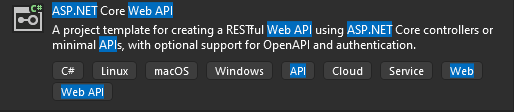

# Creating an app with nuxt + asp.net + postgres + quasar

[youtube](https://www.youtube.com/playlist?list=PLOeFnOV9YBa4LslgNo31ukBrwpJTz7BzM)

- [Creating an app with nuxt + asp.net + postgres + quasar](#creating-an-app-with-nuxt--aspnet--postgres--quasar)
  - [Tech stack](#tech-stack)
  - [About the Tricking Library](#about-the-tricking-library)
  - [Other Helpful links](#other-helpful-links)
- [Initialize the app](#initialize-the-app)
  - [Configure endpoint](#configure-endpoint)
  - [Fix SSL](#fix-ssl)

## Tech stack

Closely following the youtube guide with the same or similar tools. This app uses:

- ASP.net core 8 (backend api)
  - Web api
  - entity framework (orm)
  - ImageSharp (image processing)
  - Xabe.FFmpeg (video processing)
- Nuxt (Vue3 ui framework)
  - useFetch (fetch/axios replacement)
  - pinia (state management)
- Quasar 2 (ui style)
- Vite (frontend tooling)
  - fetch replacement
- Postgres 16 (database)
- S3 storage (file, like video, storage)
  - Keep VM stateless, we can scrap/deploy our server without loosing data.
  - Common cloud storage solution, supported by most cloud providers
- Nginx (hosting helper)
  - Cloud console, to manage our app on the server.
- Linode (hosting)
  - cheap, scalable
- Git hub actions (source control + ci/cd pipeline)
  - Similar to azure pipelines, i may consider using those instead...

This app will not be using (from the youtube guide):

- vuetify (instead using quasar )
- axios (instead using useFetch from Nuxt)
- vuex store (instead using pinia)

TODO: MediatR (crqs) ?

## About the Tricking Library

We are creating a nuxt app/server for SSR and an asp.net server for the API. We need
to have two servers to leverage SSR with nuxt. The downside is the two servers need
to talk with each other, creating extra work. We can use Nginx to create a Reverse
Proxy to speed up the routing.

We will be be creating a media content web app called Tricking Library. This app
has:

- Video hosting
- moderation / voting
- social network
- public api?

## Other Helpful links

[ASP.NET Core](https://dotnet.microsoft.com/download)
[MediatR](https://github.com/jbogard/MediatR)\
[EF Core](https://docs.microsoft.com/en-us/ef/c)
[ImageSharp](https://github.com/SixLabors/ImageSharp)
[Xabe.FFmpeg](https://github.com/tomaszzmuda/Xabe.F)\
[Nuxtjs](https://nuxtjs.org/)\
[Quasar-nuxt](https://nuxt.com/modules/quasar)\
[Axios-nuxt](https://axios.nuxtjs.org/)\
[PostgreSQL](https://www.postgresql.org/)\
[S3 FileStorage](https://docs.ceph.com/docs/mimic/rado)\
[Git](https://git-scm.com/)\
[Github](https://github.com/)\
[Github Actions](https://help.github.com/en/actions)\
[NGINX](https://docs.nginx.com/nginx/admin-gu)\
[Linode](https://www.linode.com/)\
[Rider](https://www.jetbrains.com/rider/)\
[Windows Terminal](https://github.com/microsoft/terminal)\
[WSL](https://docs.microsoft.com/en-us/wind)\
[LinqPad](https://www.linqpad.net/)

# Initialize the app

Create a new ASP.net core web api project in Visual studio. Do not use
the vue template. Its easier to install nuxt separately, then hook them
up. I am using .NET 8.0 (LTS), and left all other settings default. I
named the project TrickingLibrary.API.



In the terminal, go to the root of the solution, and add a new vite project
with:

`npm create vite@latest`

- I named the project TrickingLibrary.client.
- select vue
- select nuxt
- select npm

Startup the dev client-server by running:

`npm run dev`

Add quasar to the client with:

`npm install quasar @quasar/extras`\
`npx nuxi@latest module add quasar`

## Configure endpoint

Go to the asp.net project's `Program.cs` file. Add the 'Allow all' CORS policy:

```cs
...
builder.Services.AddCors( options =>
{
   options.AddPolicy( "AllowAll", b =>
   {
      b.AllowAnyHeader().AllowAnyOrigin().AllowAnyMethod();
   });
});

var app = builder.Build();
app.UseCors( "AllowAll" );
...
```

Now, in our client, we can use nuxt's useFetch() to get data from the
asp.net server. Note that useFetch runs on the server, so the fetch to
the asp.net api is being performed on the 'nuxt' server.

```html
<template>
  <pre>{{ data }}</pre>
</template>

<script setup>
  const data = await useFetch( 'https://localhost:7041/WeatherForecast' )
</script>
```

## Fix SSL

You may have an issue with SSL certification on your asp.net app because
you do not have a license. Create one with something like certbot, or we
can do this later. To get around this in our dev setup, create/edit
the `.env` file in the root of the client project. Then assign
`NODE_TLS_REJECT_UNAUTHORIZED=0` to disable SSL. REMOVE THIS IN PRODUCTION.
